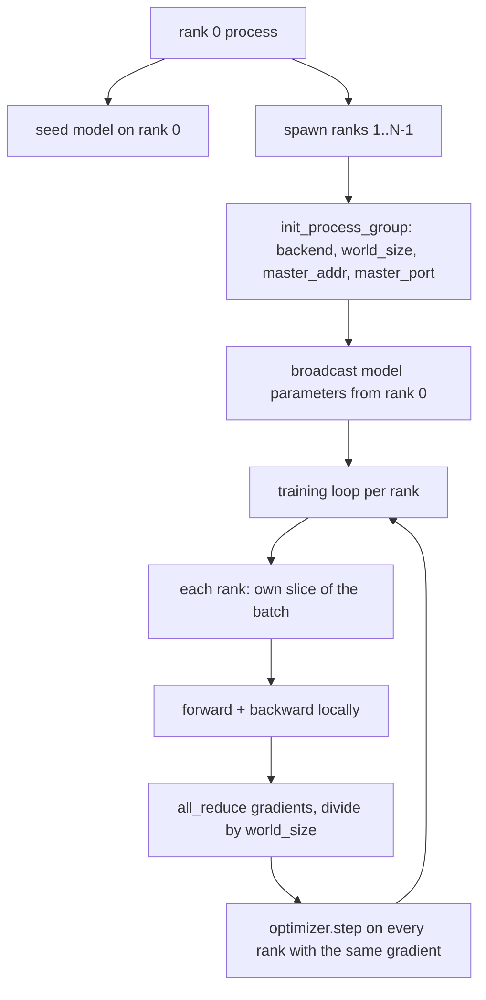
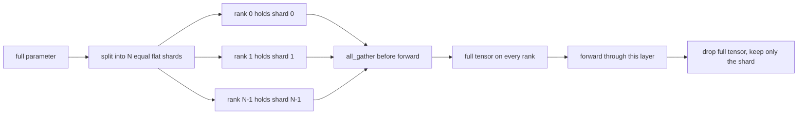

# Distributed Data Parallel and FSDP from Scratch

> Multi-rank training is two collectives and one rule. Broadcast the parameters at startup, average the gradients after backward, never let the ranks disagree about what step they are on.

**Type:** Build
**Languages:** Python
**Prerequisites:** Phase 19 lessons 42 to 45
**Time:** ~90 minutes

## Learning Objectives

- Bring up a process group across N ranks with the `gloo` backend, no special hardware.
- Implement a minimal DDP wrapper that broadcasts parameters at construction and all-reduces gradients after backward.
- Prove that the all-reduce of per-rank gradients matches a single-process gradient on the concatenated input.
- Sketch FSDP parameter sharding: each rank holds a slice, the full tensor is gathered for the forward pass and dropped after.

## The Problem

The model fits on one device. The dataset does not. The optimization budget says you want to see N times the examples per wallclock second. The first lever is data parallel: each rank runs the same model on a different slice of the batch, then averages gradients before the optimizer step. The second lever is FSDP: the model does not fit on one device either, so each rank holds a fraction of every parameter and reconstructs the full tensors layer by layer during the forward pass.

The pain is the bookkeeping. If parameters drift across ranks the run is silently corrupt. If you average gradients but not the loss the dashboard lies. If the collective backend cannot agree on a topology the run hangs forever. The fix is to write the collectives by hand once and never trust a wrapper you cannot reproduce.

This lesson runs on CPU. CUDA is not assumed. The `gloo` backend ships with every PyTorch build and accepts `torch.multiprocessing` workers; the same code switches to `nccl` on a multi-GPU node without changing structure.

## The Concept



### The two collectives that matter

| Collective | What it does | When |
|------------|--------------|------|
| `broadcast` | Copy a tensor from one rank to all others | Parameter init, scheduler state, any one-to-all sync |
| `all_reduce` | Sum (or mean, or max) a tensor across all ranks, every rank gets the result | Gradient averaging after backward |
| `all_gather` | Each rank contributes a tensor, every rank gets the concatenation | Logits collection, FSDP parameter unshard |

The DDP contract is `broadcast` at construction and `all_reduce` after backward. The FSDP sketch adds `all_gather` before each layer's forward pass.

### Gradient averaging matches single-process gradient

A model trained on a batch of B examples across N ranks must produce the same gradient as a single process training on a batch of N*B. The trick is that summing per-rank gradients and dividing by N gives the average loss gradient, which is what cross entropy with mean reduction would produce on the full batch. The lesson code asserts this with `max-abs-diff < 1e-3` between the manual all-reduce gradient and the reference single-process gradient.

### FSDP sketch



The memory win is exact: per-rank memory for parameters drops to 1/N. The cost is the gather, which is paid every forward pass. Production FSDP overlaps the gather with the previous layer's compute so the wallclock cost is much smaller than the naive accounting predicts. The lesson does the round-trip on every parameter and asserts the reconstruction is bit-equal to the original.

### CPU and the gloo backend

CUDA is the production target, but the same code paths exist on CPU. `gloo` is the CPU collective backend. It is slower than `nccl` on GPUs by orders of magnitude, but the API surface is identical. The lesson's process group is initialized with `backend="gloo"` and ranks are spawned with `torch.multiprocessing` rather than `torchrun`; both end up at the same `torch.distributed` calls. On a multi-GPU node, the only changes are `backend="nccl"`, device tensors, and `torchrun` to launch.

## Build It

`code/main.py` is the runnable artifact.

### Step 1: bring up the process group

```python
os.environ["MASTER_ADDR"] = "127.0.0.1"
os.environ["MASTER_PORT"] = str(port)
dist.init_process_group(backend="gloo", rank=rank, world_size=world_size)
```

`MASTER_ADDR` and `MASTER_PORT` are the rendezvous: every rank dials the same port on the same host. The lesson picks a free port via a bind-and-close trick to avoid collisions when several runs share a machine.

### Step 2: broadcast at construction

`MinimalDDP.__init__` walks every parameter and buffer and calls `dist.broadcast(tensor, src=0)`. Rank 0's values become the canonical init. Without this, each rank initializes with its own seed and the ranks diverge from step one.

### Step 3: all-reduce gradients after backward

```python
def all_reduce_grads_(module, world_size):
    for p in module.parameters():
        if p.grad is None:
            p.grad = torch.zeros_like(p.data)
        dist.all_reduce(p.grad.data, op=dist.ReduceOp.SUM)
        p.grad.data.div_(world_size)
```

Every rank ends up with the same averaged gradient. The optimizer step is now a function of the same input on every rank, which is why the parameters stay in sync across the run.

### Step 4: prove the equivalence

`manual_all_reduce_matches_single_process` builds the same model on rank 0 and compares the post-all-reduce gradient against the gradient a single process would compute on the concatenated input. The max-abs-diff is around 1e-8.

### Step 5: FSDP round trip

`fsdp_round_trip_sketch` flattens each parameter, pads to a multiple of `world_size`, slices, all-gathers, and unpads. Every rank's reconstruction equals the original. This is the unshard step; the inverse (re-shard after the forward) is one slice off the gathered tensor.

Run it:

```bash
python3 code/main.py
```

Default world size is 2. Two CPU processes spawn, talk to each other through `gloo`, and exit zero. The output `outputs/ddp-demo.json` captures parameter sums per rank, the gradient norm after all-reduce, the FSDP round-trip result, and the manual-vs-reference gradient diff.

## Use It

Production training stacks call the same primitives. PyTorch's `DistributedDataParallel` adds: post-backward gradient hooks that overlap all-reduce with backward, bucketed all-reduce that combines several small gradients into one collective, and the `no_sync` context lesson 46 used.

PyTorch's FSDP adds: a flat parameter view per layer so each rank holds one contiguous buffer, overlap of the next layer's unshard with the current layer's compute, and optional CPU offload for the shards.

The shape stays the same: broadcast at startup, reduce after backward, shard parameters when they no longer fit.

## Ship It

`outputs/skill-distributed-fsdp-ddp.md` carries the recipe for a new training script: spin up the process group with `gloo` for CPU and `nccl` for GPU, wrap the model in a DDP shell that broadcasts at construction and reduces after backward, optionally shard parameters with the all_gather pattern from the FSDP sketch.

## Exercises

1. Run with `--world-size 4` and confirm the param spread stays under 1e-3 across the run.
2. Replace the manual averaging with `dist.all_reduce(op=dist.ReduceOp.AVG)` and time the difference.
3. Add a post-backward hook to the DDP wrapper so the all-reduce overlaps with the rest of the backward; measure the wallclock improvement.
4. Implement the FSDP re-shard step: after the forward pass, replace the full tensor with the local shard again. Confirm per-rank memory drops.
5. Switch the backend to `nccl` on a CUDA box. Note which environment variables change and which stay the same.

## Key Terms

| Term | What people say | What it actually means |
|------|-----------------|------------------------|
| Backend | "gloo or nccl" | The library that implements the collective ops; gloo is CPU, nccl is GPU |
| World size | "Total ranks" | Number of processes in the group; the group is the unit collectives operate on |
| Rank | "Worker id" | Process identifier within the group, zero indexed |
| All-reduce | "Sum the grads" | Sum a tensor across all ranks, every rank ends with the same result |
| Unshard | "Gather the params" | Reconstruct the full tensor from per-rank slices via all_gather |

## Further Reading

- PyTorch `torch.distributed` documentation for the collective semantics this lesson relies on.
- The `gloo` library's collective list, identical in shape to the CUDA-backed `nccl` primitives.
- Phase 19 lesson 46 for the gradient accumulation pattern that wraps the DDP all-reduce in `no_sync`.
- Phase 19 lesson 47 for the checkpoint layout that survives DDP and FSDP runs.
- PyTorch FSDP documentation for the production implementation of the parameter sharding sketched here.
